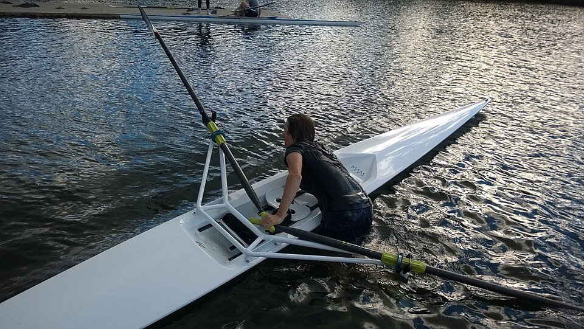
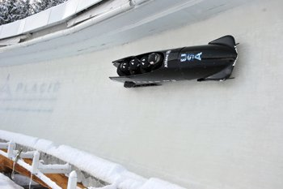

# The Training Effect

## Introduction: The Human Engine and the Problem of Improvement

*Image attribution: [Milo of Croton (1821) - Vatican Museums.jpg](https://upload.wikimedia.org/wikipedia/commons/thumb/e/e4/Milo_of_Croton_%281821%29_-_Vatican_Museums.jpg/960px-Milo_of_Croton_%281821%29_-_Vatican_Museums.jpg) via Wikimedia Commons.*

<!-- IMAGE: human engine athlete training historical gymnasium -->

The most seductive idea in training is that improvement is a moral event. Work harder, suffer longer, want it more: the body, suitably impressed by the quality of your character, will eventually yield. This belief has furnished locker-room speeches, military manuals, corporate retreats, and a surprising number of bad marathon plans. It is also, like many durable errors, close enough to the truth to be useful and far enough from it to be dangerous.

The body does respond to stress. Muscles thicken. Hearts pump more blood. Tendons stiffen, capillaries multiply, enzymes become more obliging. The nervous system learns what to ignore and what to automate. A movement that once required deliberation becomes a kind of private machinery. The runner becomes more economical; the rower less wasteful; the pianist, though usually spared the lactate testing, no less trained. Improvement is real. It can be measured in seconds, watts, kilograms, repetitions, notes per minute, or the quieter currency of effort made easier.

But it is not a simple transaction. The body is not a steam engine into which one shovels more coal to obtain more output. It is a living system, conservative by instinct and opportunistic by design. It changes when persuaded, not when bullied. Too little stress and it has no reason to adapt. Too much and it begins to protect itself, sometimes by breaking down, sometimes by mutinying in subtler ways: fatigue, illness, flatness, dread. Training is therefore the art of applying a problem the body can solve.

That art is older than sport as a business and more persistent than most management theories. Long before physiology had a vocabulary for oxygen uptake, glycogen, or neuromuscular recruitment, people noticed the pattern: repeated effort produced capacity. Farmers, soldiers, dancers, hunters, builders, monks, and messengers all learned that the human organism could be sharpened by use. Ancient athletes trained for the Olympic Games with diets, drills, and routines that mixed observation with superstition. Armies drilled not because marching in formation was inherently noble, but because coordinated movement under strain was useful. Apprentices repeated tasks until hand and eye entered into a compact.

The modern world did not invent training. It industrialised it.

Once performance could be timed, ranked, recorded, and monetised, improvement became not merely desirable but examinable. The stopwatch did for the athlete what the ledger did for the factory: it turned vague effort into comparable output. A race could be lost by a tenth of a second; a lift by a kilogram; a season by the cumulative arithmetic of small failures. In this world, talent remained valuable, but talent without method looked increasingly like wasted capital. Coaching emerged as a profession. Laboratories entered the stadium by the side door. The athlete became, in the most literal and least romantic sense, a development project.

Business has always found this analogy irresistible. Executives speak of performance, resilience, stretch goals, recovery, coaching, peak states, marginal gains. Some of this is useful; much of it is decorative. The athlete’s life is easy to plunder for metaphors because it offers the pleasing fiction of control. Train correctly and the result improves. Repeat the process and the graph rises. Who would not want such a machine inside the firm?

Yet the real lesson of training is less glamorous and more interesting. Improvement is not linear. It arrives in jumps, stalls, regressions, and delayed dividends. The work that produces progress is often invisible at the moment it is done. Recovery may look like idleness. Discipline may require doing less than one feels capable of doing. The heroic session that flatters the ego may sabotage the month. The modest session, properly placed, may be the one that matters.

This is why the history of training is also a history of disappointment with simple answers. Every generation rediscovers a version of the same questions. How much stress is enough? How hard should hard be? When is fatigue productive, and when is it merely fatigue? Does one train the general engine or the specific skill? Is the mind a limiter, a lever, or a narrator inventing explanations after the fact? Should progress be planned like a five-year programme, felt intuitively, or tracked by a device strapped to the wrist? The questions recur because

## The Oldest Training Theory: Milo, Progressive Overload, and the Myth That Happens to Be True

*Image attribution: [Craftsbury Outdoor Center Sculling Camp 2016 Vermont 01.jpg](https://upload.wikimedia.org/wikipedia/commons/thumb/3/30/Craftsbury_Outdoor_Center_Sculling_Camp_2016_Vermont_01.jpg/960px-Craftsbury_Outdoor_Center_Sculling_Camp_2016_Vermont_01.jpg) via Wikimedia Commons.*

<!-- IMAGE: Milo of Croton sculpture -->

The founding story of training involves a calf, which is an excellent start for any management theory. Milo of Croton, the great wrestler of ancient Greece, was said to have carried a young calf on his shoulders every day. As the calf grew, so did Milo. By the time the animal became a bull, the man had become strong enough to carry a bull. The tale has survived for more than two millennia because it is simple, memorable, and almost certainly improved by retelling. It is also, in its essential logic, correct.

Milo was a real figure, or at least as real as a sixth-century BC athlete can be after passing through the machinery of legend. Ancient sources credit him with repeated victories at the Olympic and Pythian Games, and later writers embroidered his life with feats of appetite, strength, and implausible death. The calf story is probably not a training diary. No sensible coach would build a programme around an animal with independent views about compliance. But as a parable of adaptation it is nearly perfect. Add stress gradually. Let the organism respond. Increase the load again. Improvement is not summoned by effort alone, but by effort applied in rising doses.

This is now called progressive overload, and it is the oldest durable idea in physical training. The body adapts to demands placed upon it. Muscles grow stronger when repeatedly asked to produce force beyond their accustomed level. The cardiovascular system becomes more capable when challenged by sustained or repeated work. Bones, tendons and connective tissues also remodel, though often more slowly and less forgivingly than ambition would prefer. The principle is not confined to strength training. A runner extends distance, increases pace, adds repetitions, or shortens recovery. A swimmer changes volume, speed, stroke quality, or rest intervals. A cyclist accumulates hours, watts, climbs, or sprints. The instruments vary; the bargain is the same.

Like many truths, progressive overload becomes dangerous when stated too cleanly. More is not a synonym for better. Load is not only weight on a bar. It is intensity, duration, frequency, density, technical complexity, emotional strain and the dull tax of life outside training. A junior analyst sleeping five hours a night and living on airport sandwiches is not starting from the same place as the same analyst after a quiet week and a civilised breakfast. Athletes learn this because bodies keep accounts. The ledger may be crude, but it is not sentimental.

The appeal of the Milo story is that it makes improvement feel automatic. Carry calf; acquire bull-carrying capacity. Repeat. In practice, adaptation is a negotiation. The stimulus must be large enough to disturb the system, but not so large that it breaks it. Too little stress and nothing much happens. Too much and the organism defends itself with fatigue, pain, illness, injury, or a sudden interest in alternative hobbies. Between these extremes lies the productive discomfort on which training depends: enough to force change, not enough to end the experiment.

This idea sounds obvious only because it has won. For much of human history, physical work was abundant but improvement was incidental. Farmers, soldiers, sailors and labourers developed capacities because their lives required them, not because someone had arranged a sequence of planned stimuli. Ancient athletes did train, and the Greeks were hardly casual about competition, but systematic knowledge accumulated slowly. What Milo gives us is not modern sport science. He gives us the seed of a method: capacity is built by exposure to progressively greater demands.

The business world has borrowed the language but often missed the constraint. It adores stretch. Stretch targets, stretch assignments, stretch roles, stretch budgets: the corporate calf is always being fattened. The premise is reasonable. People do grow by doing work that exceeds their current competence. A manager learns by managing something slightly too complicated. A salesperson improves by handling harder clients. A founder becomes better at crisis by having one, though usually not by choice. Comfort is a poor tutor.

But there is a difference between progressive overload and ritualised overloading. Milo’s calf grew by increments. The myth does not say he began with a bull, nor that he carried three calves because a consultant had benchmarked his peer group. The useful stress is calibrated. It respects sequence. It leaves room for adaptation

## Fatigue, Recovery, and the Discovery That Rest Is Part of the Work

*Image attribution: [090115 Military bobsledders dominate 4-man National Championships (4901409501).jpg](https://upload.wikimedia.org/wikipedia/commons/8/81/090115_Military_bobsledders_dominate_4-man_National_Championships_%284901409501%29.jpg) via Wikimedia Commons.*

<!-- IMAGE: runner resting track fatigue recovery -->

The first great correction to the simple gospel of overload is that work does not make you fitter while you are doing it. Work makes you tired. Fitness arrives later, if it arrives at all, as the body repairs the disturbance and prepares itself for a similar insult next time. The training session is the invoice. Adaptation is the payment. Recovery is the clearing system.

This is a less romantic account than the one preferred by locker-room poets and motivational posters. It gives the sofa a role in progress. It grants sleep, food and idleness a dignity that makes hard-driving people uneasy. Yet every durable training theory eventually has to admit it. The organism does not improve because it has been punished. It improves because, after stress, it is allowed to rebuild.

The principle is old in practice, even if modern physiology gave it sharper language. Coaches and athletes noticed long before laboratory testing became commonplace that performance fluctuated. A runner could feel invincible on Tuesday and wooden on Thursday. A rower could produce more power after an easier week than after a heroic one. Boxers, lifters and distance runners all learned versions of the same lesson: the body carries fatigue forward. Yesterday’s work sits inside today’s attempt.

Hans Selye, the endocrinologist whose work in the mid-20th century helped popularise the concept of the “general adaptation syndrome”, was not writing a manual for marathoners. His research concerned the body’s response to stress more broadly. But the vocabulary travelled well. Stress, alarm, resistance, exhaustion: the sequence had obvious appeal to coaches trying to explain why a useful dose could become a damaging one. Training is a controlled stress. Control is the operative word. Remove it, and the clever plan becomes merely a tiring life.

The sporting version is often described through the idea of supercompensation. An athlete applies a load; performance capacity dips as fatigue accumulates; with adequate recovery, the body rebounds to a slightly higher level. Apply the next load at the right moment and progress continues. Apply it too soon and fatigue deepens. Wait too long and the opportunity fades. The model is simplified, as all useful models are. Human beings do not adapt on a neat graph, and different tissues recover at different speeds. Muscles, tendons, hormones, mood and motivation do not file reports on the same schedule. Still, the central insight is sound: the gain is not in the strain alone, but in the timing of strain and release.

This is why serious training plans contain easy days, rest days and lighter weeks. They are not signs that ambition has softened. They are the machinery that makes ambition sustainable. Distance runners alternate hard sessions with easier mileage. Weightlifters vary load and volume. Team-sport coaches manage practice intensity around matches, travel and injury risk. The details differ, but the pattern is recognisable: push, absorb, push again. Even the most ferocious programmes tend to hide a rhythm beneath the shouting.

The history of modern sport is full of athletes who became great not by doing the maximum every day, but by learning what could be repeated. Emil Zátopek, the Czech distance runner famous for brutal interval sessions, is often remembered as the patron saint of suffering. The memory is not entirely wrong; his workouts were formidable. But the fascination with his hardship can obscure the larger lesson. He did not become great through random exhaustion. His training had structure, repetition and purpose. The suffering was organised. That is quite different from simply being tired all the time.

Fatigue has a peculiar moral glamour. In sport, as in business, it is easy to display and difficult to interpret. A person who looks exhausted may be dedicated, or may be badly managed. A team working late may be solving a crisis, or creating tomorrow’s. The outward signs are identical: takeaway containers, strained jokes, eyes lit by caffeine and dread. Modern offices have often mistaken depletion for commitment because depletion is visible. Adaptation is not. No one applauds the employee who goes home on time and returns sharper in the morning, though many firms would be richer if they did.

The analogy should not be pushed into softness. Training requires stress, and serious work sometimes requires long hours. There are moments when the match goes to extra time, the product fails, the factory floods

## The Four-Minute Mile: Belief, Pacing, and the Psychology of Impossible Barriers

<!-- IMAGE_URL: https://commons.wikimedia.org/wiki/Special:FilePath/Roger_Bannister_1953.jpg -->

On the evening of May 6th 1954, at the Iffley Road track in Oxford, Roger Bannister ran one mile in 3 minutes 59.4 seconds. The number is now so familiar that it risks sounding inevitable, like a door that had always been slightly ajar. At the time it was not. The four-minute mile had acquired the status of a polite impossibility: not quite a law of nature, but close enough to make sensible men speak carefully around it.

Bannister was not, by the later standards of professional sport, a full-time athletic product. He was a medical student, then a junior doctor, fitting training into the margins of an already demanding life. His preparation was serious, but brief by modern elite standards. He worked with Franz Stampfl, an Austrian-born coach who believed in interval training, and he relied on two friends, Chris Brasher and Chris Chataway, to set the pace. The race was less a solitary act of heroism than a small operational triumph: planning, weather-watching, pacing, execution. The romance came afterwards. The logistics came first.

The conditions were unhelpful. The day was windy. Bannister reportedly considered calling off the attempt. Yet the wind dropped enough in the early evening, and the group went ahead. Brasher led the first laps, Chataway took over later, and Bannister waited, coiled in discomfort, for the last bend. When he crossed the line, the stadium announcer, Norris McWhirter, began to read the time. He got as far as “three…” and the rest disappeared under the noise.

The story has often been told as a parable about belief: humanity thought the mile could not be run in under four minutes; Bannister believed it could; then everyone else believed it too. Like many parables, it is useful and slightly too tidy. The barrier was psychological, but it was not only psychological. Runners had been approaching it for years. Sweden’s Gunder Hägg had set a world record of 4:01.4 in 1945. Australia’s John Landy was chasing the mark in the early 1950s and would run 3:58.0 just 46 days after Bannister. The wall was already cracking. Bannister did not abolish physics by force of mind; he arrived at the right moment with the right method and a very efficient sense of occasion.

Still, the psychological element mattered. Round numbers have strange authority over human beings. They are administratively convenient and emotionally potent. A sales target of £10m feels different from £9.8m, though the bank may notice little difference. A company with 99 employees is a small firm; with 100 it somehow acquires a lobby, a handbook and a new anxiety about culture. In sport, such thresholds gather stories around themselves. The four-minute mile was a number, but also a narrative. To break it required fitness. To attempt it required permission.

That permission is one of the underrated functions of a benchmark. Before a barrier falls, athletes and organisations often treat it as a ceiling. After it falls, it becomes a standard, then an expectation, then a line in a junior coaching manual. What changed after Bannister was not human anatomy. The tendons of milers did not receive a software update. What changed was the distribution of confidence. Landy’s swift follow-up is sometimes used to claim that belief was the decisive ingredient. That overstates the case; Landy was already an exceptional runner on an exceptional trajectory. But it does show how quickly the impossible can be reclassified once someone has filed the paperwork.

The four-minute mile also illustrates a more prosaic lesson: belief without pacing is just enthusiasm with good public relations. Bannister’s run depended on an exact understanding of effort. A mile is short enough to invite recklessness and long enough to punish it. Go too slowly early on and the target evaporates; go too fast and the last lap becomes a tax audit of the body’s debts. Pacing is the art of spending effort at the rate most likely to buy the desired result. It is discipline

## Periodisation: How Soviet Planning Turned Training into a Calendar

<!-- IMAGE: Soviet athletes training 1950s -->

If Bannister’s mile showed that performance could be paced within a race, the next great advance was to pace the preparation itself. Training was no longer merely a heroic accumulation of exertion, like coal shoveled into a furnace. It became something more bureaucratic and, in its way, more powerful: a calendar.

The idea now goes by a word that sounds as if it escaped from a planning ministry: periodisation. At its simplest, it means arranging training into phases so that different qualities are developed at different times and fatigue is managed toward a peak. Build a base. Add intensity. Sharpen. Taper. Compete. Recover. Repeat, though never quite identically. It is the opposite of doing everything hard all the time, which has the emotional appeal of sincerity and the physiological sophistication of banging on a piano with both fists.

The Soviet Union did not invent preparation, nor did it discover that athletes should train differently before an important competition than during the off-season. Coaches had long understood seasons, rest and peaking in practical terms. What Soviet sport did, especially after the second world war, was to formalise these instincts into a system. In a state enamoured of plans, targets and five-year horizons, training acquired the language of cycles. The athlete became a project. The season became a production schedule. The body, inconveniently organic though it remained, was invited to behave like an industrial asset.

One of the central figures in this intellectual machinery was Lev Matveyev, a Soviet sports scientist whose work in the 1950s and 1960s helped codify periodisation theory. Matveyev analysed training and competition data from athletes and proposed a structured model built around preparation, competition and transition periods. Within those sat smaller units: macrocycles, mesocycles and microcycles. The names were not exactly poetic, but they were useful. A year could be divided into large blocks, those blocks into multi-week phases, and those phases into weekly or shorter patterns. Training was given architecture.

The basic logic was elegant. Adaptation takes time, and different adaptations can interfere with one another if pursued indiscriminately. A marathoner does not become excellent by sprinting hard every day, any more than a violinist improves chiefly by playing the finale as fast as possible until morale collapses. Endurance, strength, speed, technique and tactical sharpness each have their place. Some work prepares the ground for later work. Some work must be reduced so that other work can take effect. The calendar becomes a negotiation between stimulus and readiness.

In its classic form, periodisation often moved from the general to the specific. Early phases emphasised broad conditioning: volume, strength, technical rehearsal, the patient accumulation of capacity. Later phases introduced more competition-like demands: speed, intensity, tactical rhythm, race pace, event-specific polish. In the final approach to a major event, volume might fall while intensity was maintained or carefully sharpened, allowing fatigue to dissipate without letting fitness go stale. The peak was not meant to be stumbled upon. It was meant to be scheduled.

This suited the Olympic age. International sport increasingly revolved around major championships, and the cold war converted medals into diplomatic shorthand. A gold medal was not just a personal triumph; it was a communique. The Soviet sports system, like its rivals, had incentives to identify talent, organise coaching and direct resources toward particular events. Periodisation offered a rational method for producing excellence on demand, or at least on the appointed Tuesday in Melbourne, Rome or Tokyo. For administrators, it had the further virtue of looking like a plan. For coaches, it offered a shared language. For athletes, it promised that suffering could be made sequential and therefore slightly less absurd.

<!-- IMAGE: Lev Matveyev periodization training -->

There is a business lesson here, though it is frequently misapplied by executives who enjoy athletic metaphors more than athletic constraints. Periodisation is not simply “work hard, then work harder, then have a spa day before the product launch.” It is a recognition that capacity is built in layers and that peak performance is expensive. A company cannot be in permanent launch mode any more than a hurdler can be in permanent championship taper. There are seasons for exploration, seasons for building infrastructure, seasons for execution and seasons when the cleverest

## Specificity, Skill, and the End of Generic Fitness

<!-- IMAGE: Franz Stampfl Roger Bannister training Iffley Road track -->

The trouble with general fitness is that it sounds so sensible. It is hard to object to a person becoming stronger, leaner, more mobile and more enduring. It has the moral glow of good housekeeping. The body is a property; fitness is maintenance; sweat is prudence. Yet the deeper sport science moved into the twentieth century, the more awkward this tidy idea became. The body did not adapt to virtue in the abstract. It adapted to demands.

This principle became known, with pleasing bluntness, as specificity. To become better at running fast, one had to run fast, or near enough to fast that the relevant machinery was forced to improve. To become better at rowing, one had to row. To lift a heavy bar once, one had to practise producing large force in that pattern, not merely cultivate a general air of robustness. Transfer existed, especially for beginners, but it was less generous than gymnasium salesmen implied. The organism was not a bank account into which any exertion could be deposited and later withdrawn as excellence. It was more like a bureaucracy: it responded to the forms actually submitted.

Specificity did not abolish general preparation. It disciplined it. A marathon runner still benefited from strength work, but not because a heavy squat was secretly a marathon. A sprinter might use weights, jumps and drills, but only if they served acceleration, force production, stiffness, rhythm and resilience. A tennis player needed endurance, but the endurance of repeated explosive exchanges, awkward recoveries and decisions made under rising fatigue, not simply the ability to jog nobly into the middle distance. The question changed from “Is this hard?” to “Hard in what way, and for what?”

This was a quiet revolution because it moved training away from the Victorian romance of all-round manliness and toward the industrial logic of task analysis. The decathlete remained an emblem of heroic breadth, but most modern sport rewarded narrow excellence. The 100-metre final did not ask whether its contestants could also climb ropes, swim a mile and maintain attractive posture. It asked who could organise force, technique and nerve into less than ten seconds. A grand tour cyclist, a gymnast and a heavyweight boxer might all be “fit”, but the word now concealed more than it revealed. Fitness had become plural.

Skill complicated the picture further. For a long time, conditioning carried the glamour of punishment. It was visible, measurable and easy to supervise. A coach could count laps, repetitions and kilograms. Skill was slipperier. It depended on perception, timing, coordination and the nervous system’s ability to solve problems without convening a meeting. The best performers did not merely possess larger engines; they used energy economically because their technique wasted less of it. In sport, as in business, an elegant process often beats a heroic budget.

The rise of specificity therefore elevated practice itself. Not all repetition was equal. The crude prescription “do more” yielded ground to the more exacting question of what should be repeated, with what feedback, at what speed and under what pressure. A basketball player shooting alone in an empty gym was training one thing; shooting after a sprint, against a closing defender, with the game clock decaying, was training another. A footballer striking dead balls on a quiet morning was not doing the same work as one scanning, feinting and passing through a press. Even where the movement looked similar, the perceptual task could be different. The eyes were part of the lift.

This insight helped explain why champions often seemed to possess time. They had not slowed the world; they had learned what to notice and what to ignore. Expertise compressed decision-making. A novice sees the whole noisy room. An expert sees the two cues that matter. Research in motor learning and expertise has repeatedly found that skilled performers differ not only in physical capacity but in anticipation, pattern recognition and the ability to couple perception to action. The body, in other words, is trained with the brain still attached.

<!-- IMAGE: basketball player practice defender shooting -->

The end of generic fitness was also the beginning of more specialised support. The modern athlete acquired an entourage not merely from vanity, though vanity has never lacked a seat on the bus, but because performance had been divided into domains. Strength and conditioning coaches built physical qualities. Technical coaches refined movement. Physi

## High Intensity, Low Intensity, and the Modern Argument About How Hard to Work

<!-- IMAGE: athlete interval training track -->

Once training became specific, the next quarrel was inevitable: how hard should the work be? Not how much, not what kind, but how close to the red line. It is the argument that animates running clubs, cycling teams, rowing sheds, CrossFit boxes, corporate wellness programmes and, in quieter form, the inbox of every knowledge worker deciding whether to sprint through a project or build a life around steady output.

The old answer was admirably simple and frequently wrong: harder is better. Hard work had moral clarity. It produced visible suffering, which made it easy to mistake for progress. A runner bent double after intervals, a cyclist with salt on his jersey, a rower unable to speak: these were persuasive images. Coaches, like managers, have often preferred the evidence of exhaustion to the ambiguity of adaptation. If the athlete was ruined, something must have happened.

Something had happened. The question was whether it was useful.

High-intensity training has a respectable pedigree. Interval work was used by runners and coaches well before sports science could explain its mechanisms neatly. Emil Zátopek, the Czech distance runner who won the 5,000 metres, 10,000 metres and marathon at the 1952 Helsinki Olympics, became famous for brutal interval sessions: repeated fast efforts, often in large numbers, performed with an indifference to comfort that bordered on parody. His grimaces were legendary; his results were harder to dismiss. Later generations of middle-distance runners, cyclists and swimmers all found versions of the same truth. Short, hard efforts could improve speed, oxygen uptake and tolerance of discomfort. They taught the body to operate near its limits and recover just enough to go there again.

But endurance sport, with its habit of humiliating tidy theories, also produced a counterargument. Many elite athletes did not spend most of their time training heroically. They spent it going surprisingly slowly. Observational work on endurance athletes in sports such as cross-country skiing, rowing, running and cycling has often found a large share of training performed at low intensity, with a smaller but important share at high intensity and less time in the uncomfortable middle. This pattern is commonly described as “polarised” training, though terminology varies and the exact distribution differs by sport, season and athlete. The headline version, often simplified to something like 80% easy and 20% hard, is not a law of physics. It is a useful provocation.

<!-- IMAGE: cross-country skiing training -->

Its provocation lies in separating effort from value. Low-intensity work is not junk. Done properly, it builds the machinery that high-intensity work later exploits: capillary networks, mitochondrial function, fat oxidation, durability of connective tissue and the unglamorous ability to repeat work day after day. It also permits volume. A runner cannot race every morning and expect knees, hormones and domestic relationships to remain intact. Easy training is the price of consistency, and consistency is the compound interest of physiology.

This is why the modern debate is less a duel between laziness and toughness than a problem of allocation. Intensity is a powerful drug. It works, but dosage matters. Too little and the athlete never touches the capacities that decide competition. Too much and the system stops adapting and starts defending itself. The body is not impressed by motivational slogans. It responds to stress only when the stress is followed by enough recovery and embedded in enough lower-cost work to make the whole scheme sustainable.

The middle zone complicates matters. Many recreational athletes, and not a few ambitious professionals, drift toward a pace that feels satisfyingly honest but is neither easy enough to accumulate nor hard enough to sharpen the blade. It is the athletic equivalent of the meeting that feels productive because everyone is busy talking. Tempo work, threshold sessions and race-pace efforts all have legitimate uses; indeed, for many events they are essential. The mistake is not the intensity itself but the unconscious monotony of always working “moderately hard”. It produces fatigue with a pleasingly serious face.

Here the laboratory and the track have slowly converged. Exercise scientists have studied high-intensity interval training, threshold training, continuous endurance work and combinations of all three. The findings, stripped of marketing varnish, are sensible. Intense intervals can produce substantial improvements, sometimes in relatively little training time, especially for

## Data, Wearables, and the Quantified Athlete
<!-- IMAGE: athlete wearable GPS heart rate monitor -->

For most of sporting history, training data arrived through the body’s primitive but serviceable dashboard: breath, sweat, pain, appetite, sleep, mood and the coach’s narrowed eyes. The athlete knew a session had been hard because the stairs became an adversary. The coach knew the athlete was tired because the stride lost its snap or the barbell moved as if through syrup. These were not bad instruments. They were simply noisy, subjective and difficult to store in a spreadsheet.

Then came measurement.

First, in modest forms: the stopwatch, the tape measure, the lap split, the training diary. A runner who once remembered a workout as “brisk” could now write down 10 miles in 62 minutes, with the last two faster. A weightlifter could record sets, repetitions and load. Swimmers had the pool clock, rowers the ergometer, cyclists the odometer and eventually the power meter. Each device did something quietly revolutionary. It converted exertion into a number and made yesterday available for inspection.

The great modern leap has been not that athletes measure things, but that measurement has become continuous. The body, once interrogated at intervals, is now under polite surveillance. Heart-rate monitors moved from medical settings into endurance sport in the late 20th century. GPS watches made pace and distance visible in real time. Cycling power meters, which became commercially influential from the 1990s onward, told riders not merely how fast they were going but how much work they were doing, stripping away some of the deception introduced by wind, gradient and drafting. Accelerometers, sleep trackers, smart rings, glucose monitors, force plates and motion-capture systems have all joined the parade. The modern athlete may wake, train, eat and recover inside a cloud of numbers.

There is obvious value in this. Data can expose the lies that feeling tells. The enthusiastic amateur who insists every easy run is easy may discover, by heart rate or pace, that he has been conducting a daily referendum on his ego. The cyclist who believes she fades mysteriously in the final hour may see that her early power output was too ambitious. The sprinter’s force profile can reveal asymmetries invisible to the naked eye. A team-sport athlete’s GPS load may warn that a week has quietly become heavier than planned. The numbers do not make the decision, but they sharpen the question.

They also democratise expertise. Once, physiological testing belonged mainly to laboratories, national programmes and well-funded clubs. Now a recreational runner can estimate training zones, monitor resting heart rate, track sleep duration, compare splits, log perceived exertion and review months of training history while standing in a supermarket queue. Not all of this information is equally accurate, and some of it is dressed in the confident colours of false precision. But the broad trend is real. Tools once reserved for elites have become consumer products. The village jogger now owns instruments that would have impressed many Olympic coaches of a previous generation, though whether he uses them wisely is another matter.

The most useful data tend to be the least glamorous. Pace, power, duration, frequency, subjective effort, morning resting heart rate, body mass in sports where it matters, sleep patterns, injury notes: these form the accounting ledger of adaptation. They allow coach and athlete to see not just what was planned but what was actually absorbed. The distinction is crucial. Training programmes exist on paper with the serene confidence of five-year plans. Bodies execute them with complaints, negotiations and occasional strikes. Data help reveal the difference between workload assigned and workload tolerated.

This is especially important in the murky territory between fitness and breakdown. Coaches have long tried to identify the point at which useful stress becomes accumulating debt. Metrics such as training impulse, acute-to-chronic workload ratios and heart-rate variability have been used, with varying degrees of confidence, to estimate readiness or risk. None is a crystal ball. Injury is too multicausal for that: biomechanics, history, sleep, nutrition, psychology, surfaces, equipment and plain bad luck all take their share of the blame. But longitudinal measurement can make patterns harder to ignore. If performance is falling, mood is souring, sleep is deteriorating and easy sessions are producing unusually high strain, the body may be sending a memo. A wearable merely forwards it.

Team sports have embraced this logic with particular

## Training the Mind: What Physical Performance Teaches About Intellectual Performance
<!-- IMAGE: chess players training classroom -->

The temptation, after surveying modern training, is to leave the argument inside the body. Muscles adapt. Tendons stiffen. Hearts enlarge modestly. Mitochondria multiply. The athlete applies stress, permits recovery and becomes, by increments, someone else. But the more provocative lesson is that the same pattern shadows intellectual life. The mind, too, improves by exposure to difficulty that is neither trivial nor ruinous. It, too, needs repetition, feedback, rest, specificity and patience. It, too, is often betrayed by heroic nonsense.

This does not mean the brain is a biceps with better public relations. Physical and intellectual performance are not identical, and metaphors can overtrain as easily as runners. Yet the history of sport offers a useful corrective to the way many organisations still think about knowledge work. Companies exhort employees to innovate, focus, collaborate and “raise the bar”, as if excellence were mainly a matter of attitude. Schools praise talent, firms hire for pedigree, and managers confuse busyness with development. Sport, being crueller and more measurable, has had less room for such sentimentality. A runner either runs faster or does not. A swimmer either touches the wall first or offers an explanation to nobody in particular.

The first transferable idea is progressive overload. Intellectual ability grows when people work at the edge of their present competence: reading harder material, solving tougher problems, practising more demanding cases, receiving sharper criticism. The edge matters. Work that is too easy becomes maintenance. Work that is impossibly hard becomes theatre. A junior analyst learns more from building a model just beyond his current skill than from formatting slides until his soul leaves his body. A medical student learns by seeing cases, making supervised judgments and correcting errors. A musician learns scales not because scales are charming, but because disciplined repetition makes later freedom possible.

Here sport’s hatred of vagueness is salutary. No serious coach says, “Get fitter” and leaves it there. The task is broken into sessions, intensities, skills, drills and competitions. Intellectual work often remains stuck at the slogan stage. “Think strategically.” “Be more creative.” “Improve your communication.” These are not training plans; they are corporate weather reports. A better approach asks what the performance actually requires. Is the lawyer training cross-examination, drafting, negotiation or judgment under uncertainty? Is the manager training diagnosis, prioritisation, delegation or the delicate art of not speaking first in meetings? Specificity, the lesson of modern sport, applies with equal force to the conference room. You get better at the thing you repeatedly and attentively do.

Feedback is the second lesson, and perhaps the least comfortable. Athletes live in a world of clocks, scoreboards, video analysis and coaches who notice foot position. Intellectual workers often live in a fog of delayed, politicised or nonexistent feedback. A product manager may not know for months whether a decision was wise; an executive may mistake obedience for agreement; a writer may receive praise from people who have not read past the first paragraph. Without feedback, practice hardens into habit. With it, even failure becomes usable.

The best intellectual training therefore creates shorter feedback loops. Good editors do this for writers. Good laboratories do it for scientists. Good sales organisations do it through call reviews and conversion data. Good chess players have long done it by analysing games, especially the lost ones, which are more educational and less agreeable. The point is not surveillance. It is calibration. Human beings are gifted self-deceivers. We need external reality to interrupt the monologue.

The third lesson is recovery. This may be the hardest for ambitious knowledge workers to accept, because mental fatigue is less visible than a limp. The office athlete can always send one more email, join one more call, read one more memo while technically present at dinner. But cognition has limits. Attention frays. Judgment coarsens. Creativity, that shy animal, does not reliably appear under fluorescent siege conditions.

Research on sleep, though still evolving in its details, is unambiguous on the broad point: chronic sleep loss impairs attention, learning and decision-making. Breaks also matter. Complex problems often benefit from periods away from direct effort, not

## Conclusion: Adaptation, Not Heroics

<!-- IMAGE: athlete resting after training track -->

The romance of training is the romance of ordeal. We like the picture of the runner alone in the rain, the boxer pounding a heavy bag in a deserted gym, the founder sleeping under a desk beside a cooling pizza, the scholar working by lamplight while ordinary mortals waste their lives in bed. It is a durable image because it flatters both the performer and the audience. The performer gets to feel chosen. The audience gets a simple story: greatness is suffering with better public relations.

But the history of training tells a subtler and more useful tale. Improvement is not purchased by pain alone. It is produced by adaptation. The body, and to a considerable extent the mind, changes in response to demands that are sufficiently specific, sufficiently repeated, sufficiently measured and sufficiently recovered from. Stress is the signal. Recovery is the construction. Skill is the direction. Feedback is the map. Without any one of these, heroics become expensive theatre.

Milo’s calf still matters because it captures the basic logic of progressive overload: ask a little more, then a little more again. Yet the myth is incomplete if imagined as mere stubbornness. Had Milo picked up an ox on the first day, the story would have ended not in legend but in orthopaedics. The lesson is not “more”. It is “more than before, but not ruinously more”. That distinction is the difference between training and self-harm, between ambition and impatience wearing a tracksuit.

Modern sport has spent more than a century refining this distinction. Coaches learned that fatigue is not proof of progress, that rest is not the enemy of work, and that the calendar can be as important as the workout. The four-minute mile showed that belief and pacing alter the boundaries of performance, though not by abolishing physiology. Periodisation turned aspiration into blocks, cycles and peaks. Specificity ended the age of vague toughness. The long argument between high intensity and low intensity reminded athletes that there is no single magic setting on the dial. Wearables then arrived to quantify what coaches had long suspected: the organism is always speaking, even if not always in a language the dashboard understands.

The most striking lesson is how unglamorous excellence becomes at close range. It is less a thunderclap than an accounting system. Loads are added. Responses are observed. Errors are corrected. Sleep is protected. Easy days are kept easy, hard days made purposeful. The great performers may possess unusual gifts, but they also tend to submit to unusually ordinary disciplines. They do the work, then they allow the work to take effect. This second part is where many ambitious people fail. They can tolerate effort. They cannot tolerate absorption.

Business culture has often borrowed the wrong metaphors from sport. It admires the final sprint, the comeback, the heroic push, the executive who grinds through exhaustion as though judgment improves in proportion to inbox traffic. Yet in sport the heroic push is typically meaningful because it sits atop months or years of deliberately managed preparation. Nobody would design a marathon programme consisting entirely of finishing kicks. Nobody sensible would ask a weightlifter to attempt a personal record every morning because yesterday’s courage was so inspiring. In offices, however, versions of this plan are still treated as leadership.

The training effect offers a better model for performance in organisations. Improvement should be designed, not merely demanded. People need clear targets, repeated practice, honest feedback and room to recover. Teams need seasons: periods of exploration, building, execution and reflection. Careers need progression rather than perpetual emergency. Even the hardest-charging company benefits from distinguishing between a race, a rehearsal and a repair day. To say so is not to pamper anyone. It is to acknowledge that human beings are biological systems, not motivational slogans with calendars attached.

This does not mean comfort is the goal. Adaptation requires friction. Muscles grow because they are challenged. Skills deepen because the current level of performance is made inadequate. Minds sharpen when they encounter problems just beyond their present reach. The modern cult of ease is no wiser than the old cult of suffering. Training lives between them. It asks for discomfort with a purpose, strain with a plan, repetition without mindlessness and rest without guilt.

Nor does the training effect promise equal outcomes. Biology is not democratic, and neither are opportunity, coaching, time or luck. Some people begin with larger

<!-- GENERATED_IMAGE_ATTRIBUTION_START -->
## Image Attributions

- [Milo of Croton (1821) - Vatican Museums.jpg](https://upload.wikimedia.org/wikipedia/commons/thumb/e/e4/Milo_of_Croton_%281821%29_-_Vatican_Museums.jpg/960px-Milo_of_Croton_%281821%29_-_Vatican_Museums.jpg) via Wikimedia Commons
- [Craftsbury Outdoor Center Sculling Camp 2016 Vermont 01.jpg](https://upload.wikimedia.org/wikipedia/commons/thumb/3/30/Craftsbury_Outdoor_Center_Sculling_Camp_2016_Vermont_01.jpg/960px-Craftsbury_Outdoor_Center_Sculling_Camp_2016_Vermont_01.jpg) via Wikimedia Commons
- [090115 Military bobsledders dominate 4-man National Championships (4901409501).jpg](https://upload.wikimedia.org/wikipedia/commons/8/81/090115_Military_bobsledders_dominate_4-man_National_Championships_%284901409501%29.jpg) via Wikimedia Commons

<!-- GENERATED_IMAGE_ATTRIBUTION_END -->
